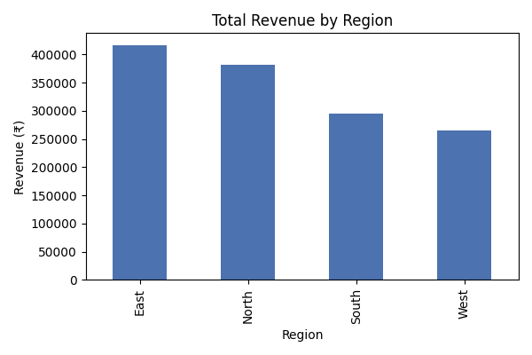
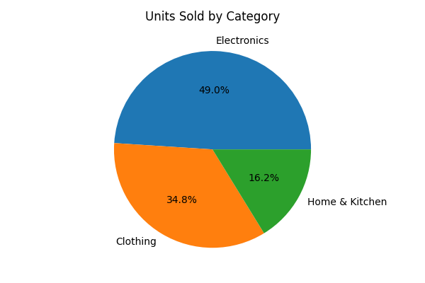
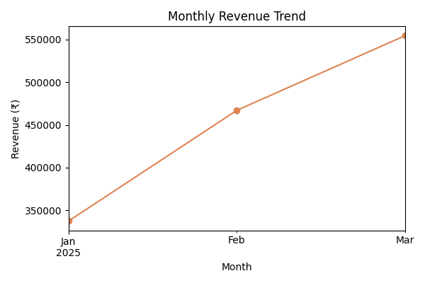

# 📊 Sales Data Analyzer

A beginner-friendly, end-to-end data analysis project built with **Python, pandas, and matplotlib**. It takes a raw sales dataset and answers common business questions a Data Analyst is asked — region-wise revenue, category-wise sales, monthly trends, and top products.

## 🔍 What it does

- Loads sales data from a CSV file
- Calculates **total revenue by region**
- Calculates **units sold by category**
- Plots the **monthly revenue trend**
- Finds the **top 5 best-selling products**
- Saves all charts as PNG images in the `outputs/` folder

## 📁 Project Structure

```
sales-data-analyzer/
├── data/
│   └── sales_data.csv       # Sample sales dataset
├── outputs/                 # Generated charts (created after running)
├── analyze.py                # Main analysis script
├── requirements.txt
└── README.md
```

## 🚀 How to run

```bash
# 1. Clone the repo
git clone https://github.com/alokkcodex/sales-data-analyzer.git
cd sales-data-analyzer

# 2. Install dependencies
pip install -r requirements.txt

# 3. Run the analysis
python analyze.py
```

## 📈 Sample Output

```
Total revenue: ₹1,358,934

Revenue by Region:
East     417082
North    381235
South    295720
West     264897

Top 5 Products by Revenue:
Wireless Earbuds    247335
Denim Jeans         162375
Power Bank          134850
Air Fryer           122465
Winter Jacket       119940
```

### Revenue by Region


### Units Sold by Category


### Monthly Revenue Trend


## 🛠️ Built With

- Python 3
- pandas
- matplotlib

## 📌 Future Improvements

- Add a Jupyter notebook version with deeper EDA
- Build an interactive dashboard using Streamlit
- Add year-over-year comparison once more data is available

---
*Built as part of my Data Analyst skill-building journey.*
